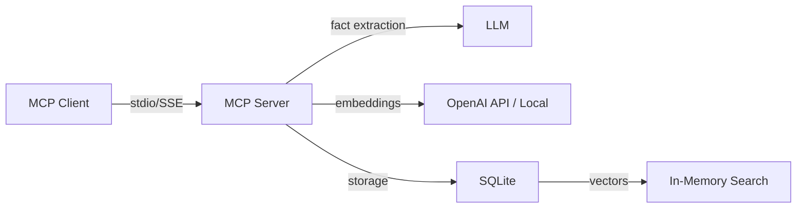

# MCP Local Memory - Complete Documentation

A simple, focused MCP memory server with **embedded SQLite vector search**. Zero external services required.

> **For users:** See [README.md](./README.md) for simple installation instructions.  
> **For developers:** This document contains complete technical details.

## Overview



**Architecture:** Memories → Facts model
- **Memories**: Short narratives (4-5 sentences) with context tags
- **Facts**: Atomic statements extracted by LLM or provided manually
- **Search**: Vector similarity on facts with tag boosting
- **Embeddings**: OpenAI (1536D) or local models (384D)

## Features

- **Zero services** - No Docker, just SQLite + Node.js
- **Smart fact extraction** - LLM splits memories into searchable facts (OpenAI mode)
- **Context tags** - LLM-assigned or manual tags for organization
- **Single file** - Entire database in one SQLite file
- **Fast** - Sub-ms vector search for ~2-3K facts
- **Two interfaces** - stdio or SSE
- **Three embedding modes** - OpenAI, Local English, Local Multilingual
- **Mode switching** - Change embedding modes on-the-fly

## Quick Start

### For End Users

See [README.md](./README.md) for simple installation instructions.

### For Developers

```bash
git clone <repo-url>
cd mcp-local-memory
npm install
npm run build
```

**Configuration:**

Create `.env` file:
```bash
OPENAI_API_KEY=sk-your-key-here
CONTEXT_ID=default
LANGUAGE_MODE=multilang  # or 'en'
SQLITE_PATH=~/Documents/mcp-personal-memory/memory.db
```

**Run:**
```bash
# stdio mode (for MCP clients)
node dist/index.js

# SSE mode (HTTP API)
npm start
```

## Installation

### via npx (Recommended for Users)

**Claude Desktop / Cursor:**

```json
{
  "mcpServers": {
    "memory": {
      "command": "npx",
      "args": ["-y", "mcp-local-memory"],
      "env": {
        "OPENAI_API_KEY": "sk-your-key-here",
        "CONTEXT_ID": "default"
      }
    }
  }
}
```

See [examples/](./examples/) for more configuration options.

### From Source

```bash
git clone <repo-url>
cd mcp-local-memory
npm install
npm run build

# Add to MCP config:
{
  "mcpServers": {
    "memory": {
      "command": "node",
      "args": ["/absolute/path/to/mcp-local-memory/dist/index.js"],
      "env": {
        "OPENAI_API_KEY": "sk-your-key",
        "CONTEXT_ID": "default"
      }
    }
  }
}
```

## Embedding Modes

MCP Local Memory supports three embedding modes.

### OpenAI Mode (Default when API key present)

- **Dimensions:** 1536D
- **Model:** text-embedding-3-small
- **Fact Extraction:** Automatic via GPT-4o-mini
- **Best for:** Production use, highest accuracy, automatic fact extraction

**Configuration:**
```bash
OPENAI_API_KEY=sk-your-key-here
```

### Local Multilingual Mode (Default when no API key)

- **Dimensions:** 384D
- **Model:** Xenova/paraphrase-multilingual-MiniLM-L12-v2
- **Size:** ~130MB (one-time download)
- **Fact Extraction:** Manual only
- **Languages:** 50+ languages
- **Best for:** Multilingual content, offline operation, privacy

**Configuration:**
```bash
LANGUAGE_MODE=multilang
```

### Local English Mode

- **Dimensions:** 384D
- **Model:** Xenova/bge-small-en-v1.5
- **Size:** ~120MB (one-time download)
- **Fact Extraction:** Manual only
- **Best for:** English-only content, offline operation, slightly better quality than multilingual

**Configuration:**
```bash
LANGUAGE_MODE=en
```

### Mode Switching

Agents can switch modes using the `switch_embedding_mode` tool:

```json
{
  "name": "switch_embedding_mode",
  "arguments": {
    "mode": "local_multilingual"
  }
}
```

This is automatically suggested when OpenAI API fails (rate limits, authentication errors, etc.).

## MCP Tools

### add_memory

Store a new memory with context tags.

**Parameters:**
- `text` (required): Memory content (4-5 sentences, focused on single topic)
- `context_tags` (optional): Array of tags (e.g., `['typescript', 'coding-standards']`)
- `facts` (optional): Array of facts. If omitted, AI extracts automatically (OpenAI mode only)

**OpenAI Mode Response:**
```json
{
  "success": true,
  "memory": {
    "id": "abc123",
    "text": "User prefers TypeScript with strict mode",
    "context_tags": ["typescript", "preferences"],
    "created_at": "2025-11-09T12:00:00.000Z"
  },
  "facts": [
    "User prefers TypeScript",
    "User uses strict mode"
  ]
}
```

**Local Mode (Manual Facts):**
```json
{
  "success": true,
  "memory": { /* ... */ },
  "facts_count": 2
}
```

### search_memory

Semantic search through memories. Primary retrieval method.

**Parameters:**
- `query` (required): What to find (e.g., "TypeScript preferences")
- `context_tags` (optional): Filter by tags
- `limit` (optional): Max results (default: 10)

**Response:**
```json
{
  "count": 2,
  "results": [
    {
      "fact": "User prefers TypeScript",
      "memory": {
        "id": "abc123",
        "text": "User prefers TypeScript with strict mode",
        "context_tags": ["typescript", "preferences"],
        "created_at": "2025-11-09T12:00:00.000Z"
      },
      "score": 0.89
    }
  ]
}
```

### list_memories

List memories chronologically (newest first).

**Parameters:**
- `context_tags` (optional): Filter by tags
- `limit` (optional): Max memories (default: 50)

**Response:**
```json
{
  "count": 2,
  "memories": [
    {
      "id": "abc123",
      "text": "User prefers TypeScript with strict mode",
      "context_tags": ["typescript", "preferences"],
      "created_at": "2025-11-09T12:00:00.000Z",
      "updated_at": "2025-11-09T12:00:00.000Z",
      "version": 1
    }
  ]
}
```

### get_context_tags

Discover available tags/topics.

**Parameters:**
- `regex` (optional): Filter tags by regex pattern

**Response:**
```json
{
  "count": 5,
  "tags": ["typescript", "preferences", "coding", "deployment", "aws"],
  "filtered": false
}
```

**With regex filtering:**
```json
{
  "name": "get_context_tags",
  "arguments": {
    "regex": "(?i)(js|javascript|typescript)"
  }
}
```

Response (if > 150 tags):
```json
{
  "count": 234,
  "tags": ["javascript", "typescript", "js-testing", /* first 100 */],
  "filtered": true,
  "message": "Returning first 100 context tags out of 234. For a more precise search please use regex filter"
}
```

**Regex patterns supported:**
- `(?i)deploy` - Case-insensitive match
- `(?i)(js|javascript)` - Multiple alternatives
- `^test` - Starts with "test"
- `config$` - Ends with "config"

### update_memory

Update existing memory.

**Parameters:**
- `memory_id` (required): ID from list_memories or search_memory
- `text` (required): Updated content (replaces old)
- `context_tags` (optional): Updated tags
- `facts` (optional): Manual facts (if omitted, AI extracts in OpenAI mode)

**Response:**
```json
{
  "success": true,
  "memory": {
    "id": "abc123",
    "version": 2,
    "updated_at": "2025-11-09T13:00:00.000Z"
  },
  "ai_extracted": true,
  "facts": [ /* new facts if AI extracted */ ]
}
```

### delete_memory

Permanently delete a memory and all its facts.

**Parameters:**
- `memory_id` (required): ID to delete

**Response:**
```json
{
  "success": true,
  "deleted_memory_id": "abc123",
  "deleted_facts_count": 3
}
```

### switch_embedding_mode

Change embedding mode (OpenAI ↔ Local).

**Parameters:**
- `mode` (required): `"openai"`, `"local_english"`, or `"local_multilingual"`

**Response:**
```json
{
  "success": true,
  "current_mode": "local_multilingual",
  "previous_mode": "openai",
  "message": "Switched to local multilang embeddings. Model: paraphrase-multilingual-MiniLM-L12-v2 (~130MB). Note: First use will download the model...",
  "note": "Manual facts are required in local mode..."
}
```

## Tool Call Notes (Learning System)

MCP Local Memory includes a **tool call notes system** that allows AI agents to learn from successes and failures across conversations.

### Purpose

- **Prevent repeated errors** - Record what went wrong and why
- **Build expertise** - Capture working patterns for complex tools
- **Maintain style** - Remember user preferences for tool usage (comment format, task structure, etc.)
- **Cross-conversation learning** - Notes persist and accumulate over time

### Available Tools

#### get_tool_call_notes

Query existing notes before using a tool.

**Parameters:**
- `tool_name` (optional): Filter by specific tool
- `query` (optional): Semantic search through notes
- `limit` (optional): Max results (default: 10)

**Response:**
```json
{
  "count": 2,
  "notes": [
    {
      "id": "xyz789",
      "tool_name": "jira_create_task",
      "note": "User prefers tasks to include acceptance criteria and time estimates",
      "created_at": "2025-11-09T14:00:00.000Z"
    }
  ]
}
```

#### record_tool_call_note

Store a learning from tool usage.

**Parameters:**
- `tool_name` (required): Name of the tool
- `note` (required): What you learned
- `success` (required): boolean - was this a success or failure?

**When to record:**
- **Failures:** Immediately after error, BEFORE retrying
- **Successes:** After troubleshooting or discovering a working pattern
- **User feedback:** When user corrects your tool usage style

**Response:**
```json
{
  "success": true,
  "note_id": "xyz789",
  "message": "Tool call note recorded"
}
```

#### delete_tool_call_note

Remove an outdated or incorrect note.

**Parameters:**
- `note_id` (required): ID of note to delete

**Response:**
```json
{
  "success": true,
  "message": "Tool call note deleted"
}
```

### Usage Pattern

```
1. Before using a tool (especially if complex or error-prone):
   → Call get_tool_call_notes(tool_name="your_tool")
   
2. If tool call fails:
   → Call record_tool_call_note(tool_name="...", note="Error: ...", success=false)
   → Then retry with fix
   
3. After successful troubleshooting:
   → Call record_tool_call_note(tool_name="...", note="Working pattern: ...", success=true)
   
4. If user corrects your style:
   → Call record_tool_call_note(tool_name="...", note="User prefers: ...", success=true)
```

### Examples

**Recording a failure:**
```json
{
  "tool_name": "github_create_pr",
  "note": "Error: API requires 'base' branch parameter. Default 'main' doesn't work for this repo (uses 'master')",
  "success": false
}
```

**Recording a success pattern:**
```json
{
  "tool_name": "jira_create_task",
  "note": "User prefers tasks with: 1) Clear acceptance criteria, 2) Time estimate, 3) Link to related docs. Template works well.",
  "success": true
}
```

**Recording user feedback:**
```json
{
  "tool_name": "confluence_write_doc",
  "note": "User wants code blocks in documentation to always include language hint and be formatted with proper indentation",
  "success": true
}
```

### Configuration

Tool call notes are enabled by default. To disable:

```bash
ENABLE_TOOL_CALL_NOTES=false
```

## Understanding Facts

**Facts** are atomic, independently searchable statements extracted from memories.

**Example:**
```
Memory: "User prefers TypeScript with strict mode. Uses ESLint for linting."

Facts (auto-extracted in OpenAI mode):
  1. "User prefers TypeScript with strict mode"
  2. "User uses ESLint for linting"
```

**Why facts?**
- More precise search (find specific detail, not whole memory)
- Better relevance scoring (fact-level matching)
- Reduces noise in results

**OpenAI mode:**
- Facts extracted automatically by GPT-4o-mini
- Returned in response for verification
- Can override by providing `facts` array

**Local mode:**
- Must provide `facts` array manually
- Each fact should be atomic (one statement)
- More control, but requires manual effort

## Configuration

### Environment Variables

| Variable | Required | Default | Description |
|----------|----------|---------|-------------|
| `OPENAI_API_KEY` | ✅ (OpenAI mode) | - | OpenAI API key for embeddings and fact extraction |
| `CONTEXT_ID` | ✖️ | `"default"` | Context identifier (separate memories by context) |
| `LANGUAGE_MODE` | ✖️ | `"multilang"` | Local mode language: `"en"` or `"multilang"` (ignored if OpenAI key present) |
| `SQLITE_PATH` | ✖️ | `~/Documents/mcp-personal-memory/memory.db` | Database file path |
| `OPENAI_MODEL` | ✖️ | `"gpt-4o-mini"` | Model for fact extraction |
| `OPENAI_EMBEDDING_MODEL` | ✖️ | `"text-embedding-3-small"` | Embedding model |

### Multiple Contexts

Separate memories by context (work/personal/project):

```json
{
  "mcpServers": {
    "memory-work": {
      "command": "npx",
      "args": ["-y", "mcp-local-memory"],
      "env": {
        "OPENAI_API_KEY": "sk-...",
        "CONTEXT_ID": "work"
      }
    },
    "memory-personal": {
      "command": "npx",
      "args": ["-y", "mcp-local-memory"],
      "env": {
        "OPENAI_API_KEY": "sk-...",
        "CONTEXT_ID": "personal"
      }
    }
  }
}
```

All contexts share the same database but queries are isolated.

### Custom Database Location

```json
{
  "env": {
    "SQLITE_PATH": "/path/to/custom/memory.db"
  }
}
```

Useful for:
- Cloud sync (Dropbox, iCloud)
- Backups
- Multiple users on same machine

## SSE/HTTP Mode

Alternative to stdio for web/API access:

```bash
npm start
# Server runs on http://localhost:3133/mcp
```

**Test:**
```bash
curl -X POST http://localhost:3133/mcp \
  -H "Content-Type: application/json" \
  -H "Accept: application/json, text/event-stream" \
  -d '{
    "jsonrpc": "2.0",
    "id": 1,
    "method": "tools/list"
  }'
```

Or open `test-sse-client.html` in browser for interactive testing.

**Configuration:**
Port and options are set in `package.json` start script:
```json
{
  "start": "npx mcp-proxy --port 3133 --server stream --stateless --shell \"node dist/index.js\""
}
```

## Data Model

### Database Schema

**Memories Table:**
```sql
CREATE TABLE memories (
  id TEXT PRIMARY KEY,
  context_id TEXT NOT NULL,
  text TEXT NOT NULL,
  tags TEXT NOT NULL,  -- JSON array
  created_at INTEGER NOT NULL,
  updated_at INTEGER NOT NULL,
  version INTEGER DEFAULT 1
);
```

**Facts Table:**
```sql
CREATE TABLE facts (
  id TEXT PRIMARY KEY,
  memory_id TEXT NOT NULL,
  text TEXT NOT NULL,
  created_at INTEGER NOT NULL,
  FOREIGN KEY (memory_id) REFERENCES memories(id) ON DELETE CASCADE
);
```

**Vector Tables (one per embedding type):**
```sql
CREATE TABLE fact_vectors_openai (
  fact_id TEXT PRIMARY KEY,
  dim INTEGER NOT NULL DEFAULT 1536,
  embedding BLOB NOT NULL,
  FOREIGN KEY (fact_id) REFERENCES facts(id) ON DELETE CASCADE
);

CREATE TABLE fact_vectors_local_en (
  fact_id TEXT PRIMARY KEY,
  dim INTEGER NOT NULL DEFAULT 384,
  embedding BLOB NOT NULL,
  FOREIGN KEY (fact_id) REFERENCES facts(id) ON DELETE CASCADE
);

CREATE TABLE fact_vectors_local_ml (
  fact_id TEXT PRIMARY KEY,
  dim INTEGER NOT NULL DEFAULT 384,
  embedding BLOB NOT NULL,
  FOREIGN KEY (fact_id) REFERENCES facts(id) ON DELETE CASCADE
);
```

### ID Format

8-character base64url IDs:
- Memories: `pDDjnCXd`
- Facts: `a1b2c3d4`

Short, readable, collision-resistant for typical usage (~2-3K memories).

## Performance

### Timing (Typical)

| Operation | OpenAI Mode | Local Mode |
|-----------|-------------|------------|
| Add memory | ~2-3s | ~200ms |
| Search | ~100-300ms | ~50-200ms |
| List memories | <10ms | <10ms |
| Get tags | <5ms | <5ms |

**OpenAI mode:** Network latency dominates  
**Local mode:** First use: model download (1-3 min), then instant

### Scalability

Tested with:
- 2,000 memories
- 5,000 facts
- Sub-50ms search

SQLite in-memory vector search scales well to ~10K facts. Beyond that, consider:
- Increasing `lambda` parameter (reduce precision, increase speed)
- Paginated searches
- More aggressive tag filtering

## Development

### Project Structure

```
src/
├── config.ts              # Configuration management
├── database.ts            # SQLite schema and initialization
├── vector.ts              # Vector operations (normalize, dot product)
├── types.ts               # Shared type definitions
├── operations.ts          # Core business logic
├── format.ts              # Response formatting (ISO dates, snake_case)
├── main.ts                # Entry point (routes to CLI or server)
├── index.ts               # MCP server (stdio)
├── cli.ts                 # CLI commands (config, help)
├── embeddings/
│   ├── types.ts           # Embedder interface
│   ├── openai-embedder.ts # OpenAI implementation
│   ├── local-embedder.ts  # Local model implementation
│   ├── factory.ts         # Mode selection and switching
│   └── validation.ts      # OpenAI key validation
├── handlers/
│   ├── add-memory.ts
│   ├── update-memory.ts
│   ├── search-memory.ts
│   ├── list-memories.ts
│   ├── get-tags.ts
│   ├── delete-memory.ts
│   └── switch-embedding-mode.ts
└── openai.ts              # OpenAI fact splitting
```

### Scripts

```bash
npm run build              # Compile TypeScript
npm run dev                # Run with hot reload (tsx)
npm start                  # Start SSE server on port 3133
npm run start:stdio        # Start stdio server
npm test                   # Run tests
npm run test:sse           # Test SSE endpoint
npm run cleanup:all        # Delete all memories (with confirmation)
```

### Testing

**Interactive testing:**
```bash
npm test
# or
./test-interactive.sh
```

**SSE testing:**
```bash
npm start  # In one terminal
npm run test:sse  # In another
```

**Manual testing:**
```bash
# Add memory
echo '{"jsonrpc":"2.0","id":1,"method":"tools/call","params":{"name":"add_memory","arguments":{"text":"Test","context_tags":["test"],"facts":["Test fact"]}}}' | \
  OPENAI_API_KEY=sk-... node dist/index.js

# Search
echo '{"jsonrpc":"2.0","id":1,"method":"tools/call","params":{"name":"search_memory","arguments":{"query":"test"}}}' | \
  OPENAI_API_KEY=sk-... node dist/index.js
```

### Adding a New Tool

1. Create handler in `src/handlers/my-tool.ts`:
```typescript
export async function handleMyTool(args: any) {
  // Implementation
  return {
    content: [{ type: "text", text: JSON.stringify(result) }]
  };
}
```

2. Register in `src/index.ts`:
```typescript
import { handleMyTool } from "./handlers/my-tool.js";

// In ListToolsRequestSchema handler
{
  name: "my_tool",
  description: "Tool description",
  inputSchema: { /* ... */ }
}

// In CallToolRequestSchema handler
case "my_tool":
  return await handleMyTool(args);
```

3. Add types to `src/types.ts` if needed

4. Write tests

## Migration

### From Qdrant to SQLite

If you have old data in Qdrant format:

```bash
# Export from old system to JSON
# Then run:
npm run migrate:qdrant-to-sqlite path/to/export.json
```

This:
- Reads Qdrant memories
- Extracts facts using GPT-4o-mini
- Embeds with current mode
- Inserts into SQLite

### Between Embedding Modes

Switching modes preserves existing data:
- Old facts keep their original embeddings
- New facts use the current mode
- Search works across all embedding types

To re-embed everything in a single mode:
1. Export memories to JSON
2. Delete database
3. Set desired mode
4. Re-import

## Architecture

For detailed architecture, see:
- [ARCHITECTURE.md](./docs/ARCHITECTURE.md) - Flow diagrams, algorithms, performance
- [SYSTEM_PROMPT_TEMPLATE.md](./docs/SYSTEM_PROMPT_TEMPLATE.md) - Ready-to-use prompt template for AI agents

## Troubleshooting

### "Memory tool not showing up"

1. Check MCP config JSON is valid
2. Restart MCP client
3. Check console for errors: `tail -f ~/Library/Logs/Claude/mcp*.log`

### "OpenAI API error"

**401 Unauthorized:**
- Verify API key at https://platform.openai.com/api-keys
- Check for typos in config

**429 Rate Limit:**
- You've hit quota or rate limit
- Use `switch_embedding_mode` to go offline
- Or wait and try again

**402 Payment Required:**
- Add payment method to OpenAI account
- Or switch to local mode

### "Model downloading" (Local Mode)

- Normal on first use
- Takes 1-3 minutes depending on connection
- Only happens once
- Subsequent uses are instant

### Performance Issues

**Slow search:**
- Check fact count: `SELECT COUNT(*) FROM facts`
- If > 10K facts, increase lambda or use more specific tags

**Slow memory add:**
- OpenAI mode: network latency, can't optimize much
- Local mode: Should be ~200ms. Check CPU usage.

### Database Locked

If you see "database is locked":
- Close other connections to the database
- Ensure only one MCP server instance per database
- Use separate `CONTEXT_ID` for multiple servers

## Privacy & Security

**Local Storage:**
- All data stored in SQLite database on your computer
- Default: `~/Documents/mcp-personal-memory/memory.db`
- You control backups, deletion, syncing

**OpenAI Mode:**
- Memory text sent to OpenAI API for fact extraction and embedding
- Subject to OpenAI's privacy policy and data retention
- Data not used for training (as of API ToS)

**Local Mode:**
- Zero external API calls
- All processing on-device
- Models downloaded from Hugging Face (one-time)
- Complete privacy

**Recommendations:**
- Use local mode for sensitive data
- Encrypt database file for extra security
- Backup regularly to prevent data loss

## Contributing

Contributions welcome! Please:

1. Fork the repository
2. Create a feature branch
3. Write tests for new features
4. Ensure all tests pass: `npm test`
5. Follow TypeScript best practices
6. Update documentation
7. Submit a pull request

## License

MIT License - see LICENSE file

## Acknowledgments

- Built on [@modelcontextprotocol/sdk](https://github.com/modelcontextprotocol/sdk)
- Inspired by the need for simple, local memory for AI agents
- Local embeddings via [@xenova/transformers](https://github.com/xenova/transformers.js)

## Support

- **Issues:** GitHub Issues
- **Discussions:** GitHub Discussions
- **Documentation:** 
  - This file (technical details)
  - [README.md](./README.md) (user guide)
  - [ARCHITECTURE.md](./docs/architecture/ARCHITECTURE.md) (system architecture)
  - [EMBEDDING_MODES.md](./docs/architecture/EMBEDDING_MODES.md) (embedding details)
  - [SYSTEM_PROMPT_TEMPLATE.md](./docs/guides/SYSTEM_PROMPT_TEMPLATE.md) (AI agent prompt guide)
