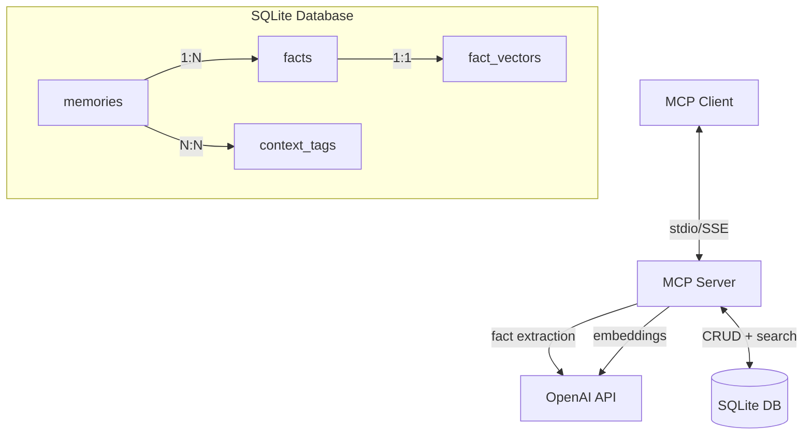
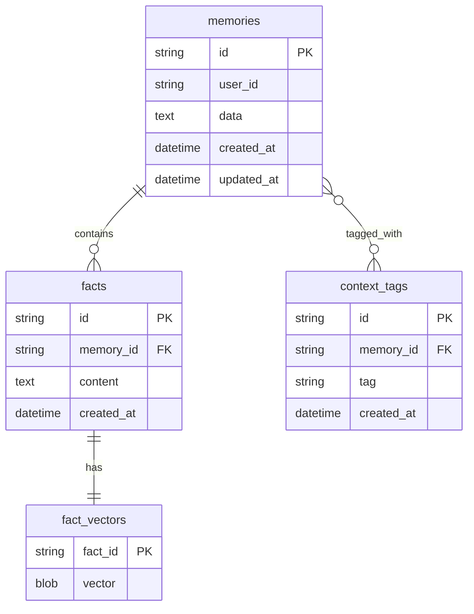
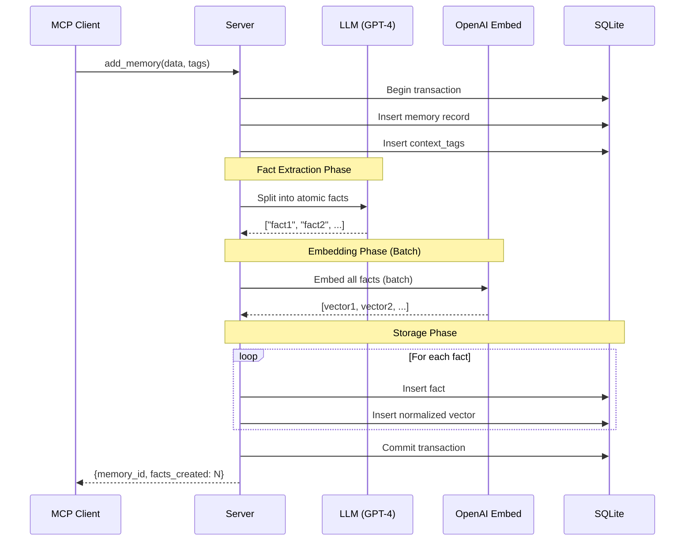
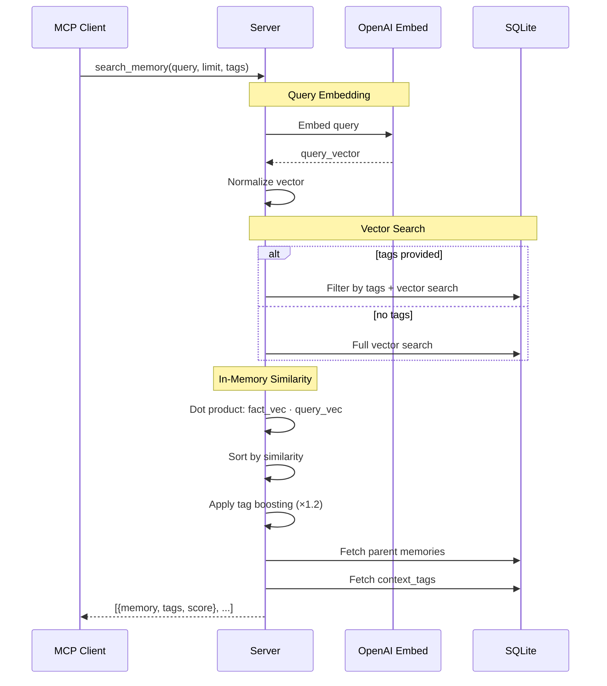
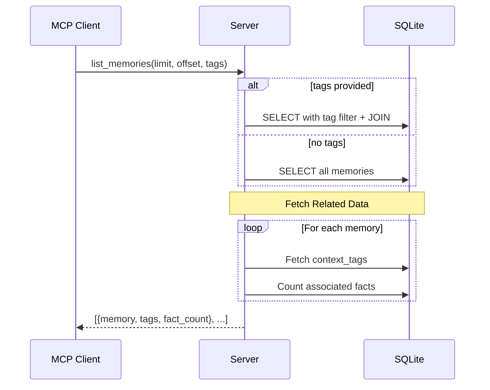
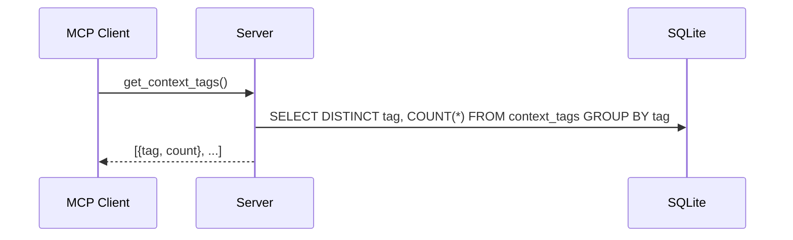

# MCP Local Memory - Architecture & Flow

## High-Level Architecture



## Data Model

### Memories → Facts Model

The system uses a hierarchical model where memories are narratives broken down into atomic facts.

**ID Format:** All IDs are 8-character base64url-encoded strings (e.g., `U2ESeh7V`) for readability and compactness.



## Core Flows

### 1. Add Memory Flow



**Key Implementation Details:**

1. **Transaction Safety:** Entire operation in one SQLite transaction
2. **Batch Embedding:** All facts embedded in single API call (cost-efficient)
3. **Vector Normalization:** Vectors normalized to unit length for dot-product search
4. **LLM Fact Splitter:** GPT-4o-mini extracts 2-5 atomic facts per memory

**Prompt Template:**
```
Split this memory into 2-5 atomic, independently searchable facts.
Memory: "{data}"
Return JSON: ["fact1", "fact2", ...]
```

### 2. Search Memory Flow



**Key Implementation Details:**

1. **Vector Search:**
   - All vectors unit-normalized (L2 norm = 1)
   - Similarity = dot product (equivalent to cosine)
   - No external vector DB needed

2. **Tag Filtering:**
   ```sql
   WHERE fact_id IN (
     SELECT f.id FROM facts f
     JOIN memories m ON f.memory_id = m.id
     JOIN context_tags t ON m.id = t.memory_id
     WHERE t.tag IN (...)
   )
   ```

3. **Tag Boosting:**
   - If fact's memory has matching tags → score × 1.2
   - Improves relevance for tagged queries

4. **Deduplication:**
   - Multiple facts may match from same memory
   - Dedupe by memory_id, keep highest score

### 3. List Memories Flow



### 4. Get Context Tags Flow



## Module Structure

```
src/
├── index.ts              # MCP server entry point
├── config.ts             # Configuration management
├── database.ts           # SQLite setup & connection
├── vector.ts             # Vector normalization & similarity
├── openai.ts             # OpenAI client & operations
├── types.ts              # Shared TypeScript types
├── operations.ts         # Core business logic
└── handlers/
    ├── add-memory.ts     # add_memory tool
    ├── search-memory.ts  # search_memory tool
    ├── list-memories.ts  # list_memories tool
    ├── get-tags.ts       # get_context_tags tool
    └── delete-all.ts     # delete_all_memories tool
```

### Module Responsibilities

| Module | Purpose |
|--------|---------|
| `config.ts` | Load/save config, env vars, defaults |
| `database.ts` | SQLite schema, connection singleton |
| `vector.ts` | `normalize()`, `dotProduct()`, `cosineSimilarity()` |
| `openai.ts` | `embedText()`, `splitIntoFacts()` |
| `operations.ts` | `addMemory()`, `searchMemories()`, `listMemories()` |
| `handlers/*` | MCP tool request → response mapping |

## Vector Search Algorithm

### Normalization

All vectors stored as unit vectors:

```typescript
function normalize(vector: number[]): number[] {
  const magnitude = Math.sqrt(vector.reduce((sum, v) => sum + v * v, 0));
  return vector.map(v => v / magnitude);
}
```

### Similarity Computation

```typescript
function dotProduct(a: number[], b: number[]): number {
  return a.reduce((sum, val, i) => sum + val * b[i], 0);
}

// For unit vectors: dot product ≈ cosine similarity
const similarity = dotProduct(queryVector, factVector);
```

### Performance Characteristics

- **Time Complexity:** O(N × D) where N = facts, D = dimensions (1536)
- **Space Complexity:** O(N × D) - all vectors in memory
- **Scalability:** ~2-3K facts → <50ms search time
- **Optimization:** SQLite stores as BLOB, loaded on demand

## Configuration System

### Precedence Order

1. **Environment variables** (highest priority)
2. **Saved config file** (`~/.mcp-local-memory/config.json`)
3. **Default values** (lowest priority)

```typescript
function loadConfig(): Config {
  const defaults = {
    sqlitePath: expandTilde('~/.mcp-local-memory/memory.db'),
    userId: 'default_user',
    openaiApiKey: '',
    model: 'gpt-4o-mini',
    embeddingModel: 'text-embedding-3-small'
  };
  
  const saved = loadFromFile();
  
  return {
    ...defaults,
    ...saved,
    // ENV always overrides
    sqlitePath: process.env.SQLITE_PATH || saved.sqlitePath || defaults.sqlitePath,
    userId: process.env.USER_ID || saved.userId || defaults.userId,
    openaiApiKey: process.env.OPENAI_API_KEY || saved.openaiApiKey
  };
}
```

## LLM Integration

### Fact Extraction Prompt

```typescript
const prompt = `
You are a memory assistant. Split the following memory into 2-5 atomic facts.
Each fact should be:
- Independently understandable
- Specific and concrete
- Searchable on its own

Memory: "${memoryData}"

Return ONLY a JSON array of fact strings.
`;
```

**Example:**

Input:
```
User prefers TypeScript for backend work. Uses strict mode and ESLint. 
Deployed on AWS Lambda with Node.js 18.
```

Output:
```json
[
  "User prefers TypeScript for backend development",
  "User uses strict mode and ESLint",
  "User deploys on AWS Lambda",
  "User uses Node.js 18 runtime"
]
```

### Embedding Model

- **Model:** `text-embedding-3-small`
- **Dimensions:** 1536
- **Cost:** $0.02 / 1M tokens
- **Batch Size:** Up to 2048 inputs per request

## Performance & Scalability

### Current Limits

| Metric | Value | Notes |
|--------|-------|-------|
| Max facts | ~10K | Before search slows |
| Max memories | ~2K | Assuming 5 facts/memory |
| Search time | <50ms | For 2-3K facts |
| Add memory time | 2-3s | LLM + embedding |

### Optimization Strategies

1. **Batch Embeddings:** All facts embedded in single API call
2. **Unit Vectors:** Pre-normalized for fast dot product
3. **Tag Indexing:** SQLite index on `context_tags.tag`
4. **Memory Pooling:** Reuse SQLite connection
5. **Lazy Loading:** Vectors loaded only during search

### Scaling Beyond 10K Facts

If needed:
1. **HNSW Index:** Add approximate nearest neighbor
2. **Vector Quantization:** Reduce memory footprint
3. **External Vector DB:** Switch to Qdrant/Pinecone
4. **Sharding:** Split by user_id or date ranges

## Error Handling

### Transaction Rollback

```typescript
try {
  db.prepare('BEGIN').run();
  // ... operations ...
  db.prepare('COMMIT').run();
} catch (error) {
  db.prepare('ROLLBACK').run();
  throw error;
}
```

### API Failures

- **Embedding failure:** Retry with exponential backoff
- **LLM timeout:** Fall back to single-fact memory
- **SQLite locked:** Wait and retry

## Security Considerations

1. **API Key:** Never log or expose
2. **SQL Injection:** Use parameterized queries only
3. **User Isolation:** Filter all queries by `user_id`
4. **File Permissions:** SQLite file should be user-readable only

## Testing Strategy

### Unit Tests (Future)

- `vector.ts` - normalization, similarity
- `operations.ts` - business logic (mocked DB)
- `handlers/*` - MCP request/response

### Integration Tests

- `test-interactive.sh` - Full flow tests
- End-to-end: add → search → list → delete

### Performance Tests

```bash
# Add 1000 memories
for i in {1..1000}; do
  curl -X POST localhost:3133/add_memory -d "{\"data\": \"Test $i\"}"
done

# Measure search time
time curl -X POST localhost:3133/search_memory -d "{\"query\": \"test\"}"
```

## Deployment

### stdio Mode (MCP Clients)

1. Build: `npm run build`
2. Configure client with `dist/index.js` path
3. Set `OPENAI_API_KEY` in client config

### SSE Mode (HTTP API)

1. Build: `npm run build`
2. Create `.env` with `OPENAI_API_KEY` and `USER_ID`
3. Run: `npm start` (uses `mcp-proxy` on port 3133)
4. Access: `http://localhost:3133/mcp`

**Configuration:**
- Uses `mcp-proxy` package with `--stateless` mode for sessionless HTTP
- Endpoint: `/mcp` (stateless stream)
- Protocol: JSON-RPC 2.0 with SSE transport
- Headers required: `Content-Type: application/json` and `Accept: application/json, text/event-stream`

**Example request:**
```bash
curl -X POST http://localhost:3133/mcp \
  -H "Content-Type: application/json" \
  -H "Accept: application/json, text/event-stream" \
  -d '{
    "jsonrpc": "2.0",
    "id": 1,
    "method": "tools/call",
    "params": {
      "name": "search_memory",
      "arguments": {"query": "test", "limit": 5}
    }
  }'
```

**Testing:**
- CLI: `npm run test:sse`
- Interactive: Open `test-sse-client.html` in browser

### Docker (Future)

```dockerfile
FROM node:18-alpine
WORKDIR /app
COPY package*.json tsconfig.json ./
COPY src ./src
RUN npm ci && npm run build
ENV NODE_ENV=production
CMD ["node", "dist/index.js"]
```

## Future Enhancements

1. **Memory Updates:** Diff facts, update only changed
2. **Soft Delete:** Mark as deleted, filter in queries
3. **Memory Relationships:** Link related memories
4. **Time-based Decay:** Weight recent memories higher
5. **Multi-user:** Full user management and permissions
6. **Compression:** Reduce vector storage size
7. **Streaming:** Stream facts during add_memory
8. **Analytics:** Usage stats, popular tags, search patterns

